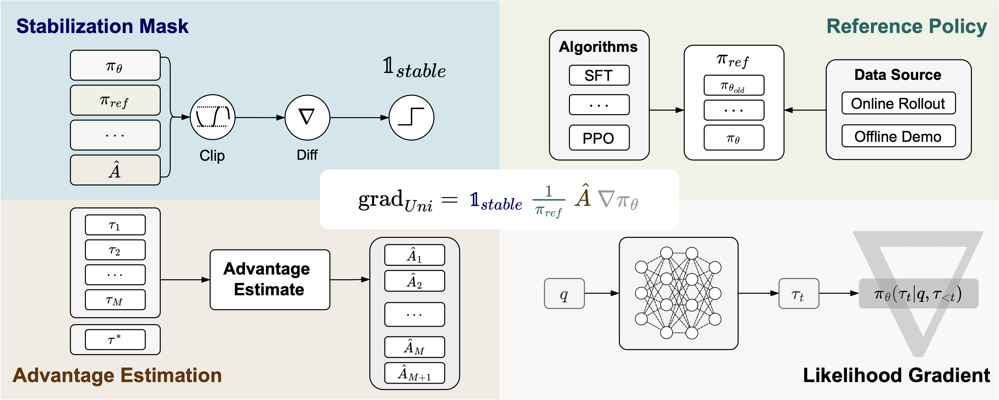
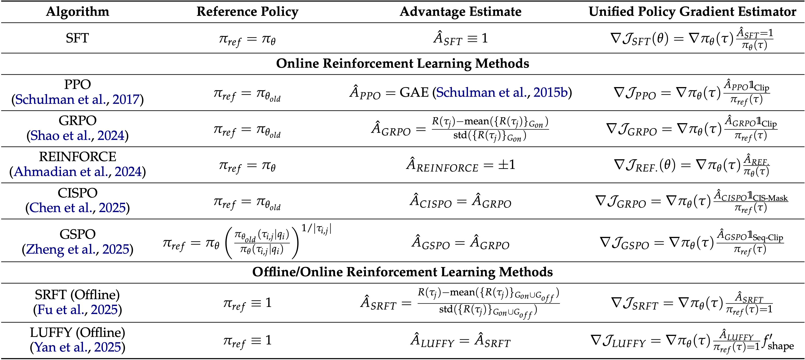
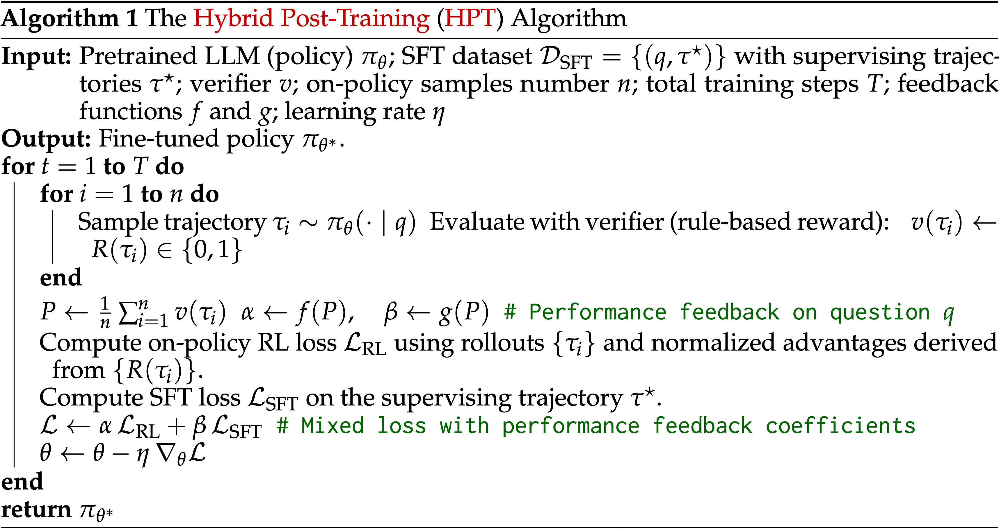
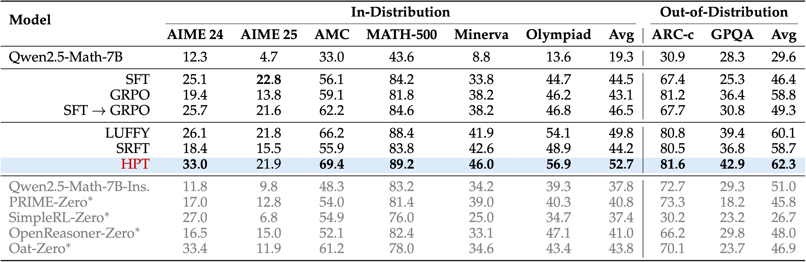
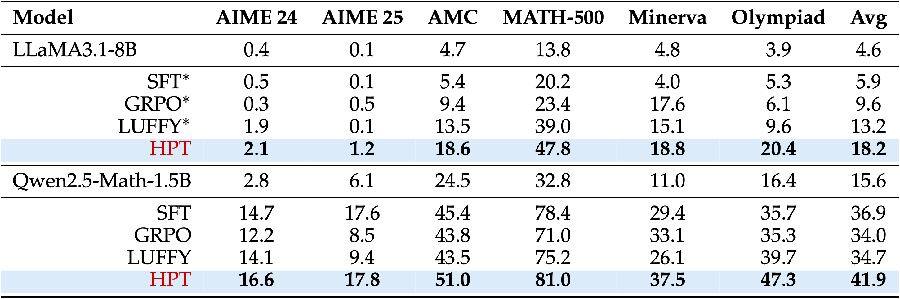

<div align="center">

# Towards a Unified View of Large Language Model Post-Training

[](https://arxiv.org/abs/2509.04419)  [](https://github.com/TsinghuaC3I/Unify-Post-Training)

</div>

<div align="center" style="font-family: Arial, sans-serif;">
  <p>
    <a href="#news" style="text-decoration: none; font-weight: bold;">🎉 News</a> •
    <a href="#introduction" style="text-decoration: none; font-weight: bold;">📖 Introduction</a> •
    <a href="#unified-policy-gradient-estimator" style="text-decoration: none; font-weight: bold;">📝 Unified Policy Gradient Estimator</a> •
    <a href="#hybrid-post-training" style="text-decoration: none; font-weight: bold;">✨ Hybrid Post-Training</a>
  </p>
  <p>
    <a href="#getting-started" style="text-decoration: none; font-weight: bold;">🚀 Getting Started</a> •
    <a href="#main-results" style="text-decoration: none; font-weight: bold;">📊 Main Results</a> •
    <a href="#acknowledgements" style="text-decoration: none; font-weight: bold;">💖 Acknowledgements</a> •
    <a href="#contact" style="text-decoration: none; font-weight: bold;">📨 Contact</a> •
    <a href="#citation" style="text-decoration: none; font-weight: bold;">🎈 Citation</a>
  </p>
</div>

> Two major sources of training data exist for post-training modern language models: on-policy (model-generated rollouts) data and off-policy (human or other-model demonstrations) data.
> 
> **In this paper, we show that these approaches are not in contradiction, but are instances of a single optimization process.**

# 🎉News

- **[2025-09-05]** We introduce Unified Policy Gradient Estimator and Hybrid Post-Training (HPT).

# 📖Introduction

We introduce **Unified Policy Gradient Estimator**, a unified theoretical framework that bridges a broad class of LLM post-training algorithms, including SFT and RL. Building upon the insights derived from this framework, we further propose **Hybrid Post-Training (HPT)**, an adaptive algorithm that dynamically alternates between SFT and RL signals in response to model performance.

<p align="center">
   
</p>


# 📝Unified Policy Gradient Estimator

> SFT and RL, though usually seen as separate training paradigms, are actually instances of a single optimization process.

We derive a unified framework that mathematically shows how diverse post-training methods naturally emerge as gradients of a shared objective, shaped by assumptions about the data distribution and the bias–variance tradeoff.
Specifically, we decompose the gradient of all post-training algorithms into four interchangeable components:
   - Stabilization mask
   - Reference-Policy denominator  
   - Advantage estimate
   - Likelihood gradient

Within this framework, the policy gradient of different post-training algorithms can be expressed as:

```math
\text{grad}_{Uni} = \mathbb{1}_{stable} \frac{1}{\pi_{ref}} \hat{A} \nabla \pi_{\theta}.
```


The figure below illustrates how several widely used post-training algorithms can be represented under this unified view:

<p align="center">
   
</p>

# ✨Hybrid Post-Training

Our HPT algorithm dynamically adapts the mixing ratio between SFT and RL losses based on model performance. Please refer to the following code snippet for details about the implementation of HPT:

<p align="center">
   
</p>

# 🚀Getting Started

To run the Hybrid Post-Training (HPT) algorithm, follow these steps:

### Env Setup
```bash
conda create -n hpt python=3.10
conda activate hpt

cd hpt
pip install git+https://github.com/NICTA/pyairports.git
pip install -r requirements.txt
pip install -e .

cd verl
pip install -e .

# For NVIDIA H20 Device 
pip install nvidia-cublas-cu12==12.4.5.8
```

### Data Preparation
For training data, you can directly download the `openr1.parquet` of LUFFY in [Elliott/Openr1-Math-46k-8192](https://huggingface.co/datasets/Elliott/Openr1-Math-46k-8192/tree/main) and put it in the `data` folder. Or you can run the following script:

```bash
cd data
python prepare_train.py
```

For validation data, you can the preprocess script:

```bash
cd data
python preprocess.py
```

### Training
You can run the following command to start our HPT algorithm:
``` bash
# For Qwen Model
bash exp_scripts/train.sh

# For LLaMA Model
bash exp_scripts/train_llama.sh
```

We also provide the scripts of our main baselines:
``` bash
# LUFFY
bash exp_scripts/train_luffy.sh

# SRFT
bash exp_scripts/train_srft.sh
```

### Testing
We perform the evaluation using the scripts provided by [DeepMath](https://github.com/zwhe99/DeepMath). You can conduct the evaluation by following [this instruction](https://github.com/zwhe99/DeepMath?tab=readme-ov-file#quick-start).

# 📊Main Results

HPT demonstrate consistent improvements across multiple models and benchmarks:

<p align="center">
  
  
</p>

# 💖Acknowledgements
Our project mainly builds upon [LUFFY](https://github.com/ElliottYan/LUFFY) and [veRL](https://github.com/volcengine/verl). We utilize [vLLM](https://github.com/vllm-project/vllm) for inference. We also leverage the datasets of [LUFFY](https://huggingface.co/collections/Elliott/luffy-rl-6804e1f5d1ebe66ba8ac92f4) and backbone models of [Qwen2.5-Math](https://github.com/QwenLM/Qwen2.5-Math) and [Llama-3.1](https://huggingface.co/meta-llama/Llama-3.1-8B). We are grateful for these significant open-source contributions.

# 📨Contact

For questions about this work, please contact:

- Xingtai Lv: lvxt24@mails.tsinghua.edu.cn
- Youbang Sun: ybsun@mail.tsinghua.edu.cn
- Ning Ding: dn97@mail.tsinghua.edu.cn

# 🎈Citation

If you find this work helpful, please cite our paper:

```bibtex
@article{lv2025towards,
  title={Towards a Unified View of Large Language Model Post-Training},
  author={Lv, Xingtai and Zuo, Yuxin and Sun, Youbang and Liu, Hongyi and Wei, Yuntian and Chen, Zhekai and He, Lixuan and Zhu, Xuekai and Zhang, Kaiyan and Wang, Bingning and others},
  journal={arXiv preprint arXiv:2509.04419},
  year={2025}
}
```
